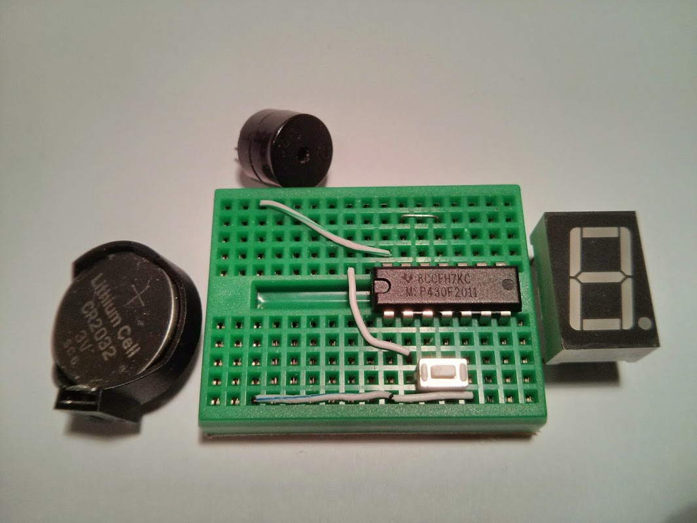

## K-Timer

```[October 2015]``` Originally created.

```UNDER CONSTRUCTION and source code not yet available```

Single Digit Kitchen Timer. Simple Construction
<iframe width="560" height="315" src="https://www.youtube.com/embed/4njROvqYT5o" frameborder="0" allow="autoplay; encrypted-media" allowfullscreen></iframe>


### Description

This is single digit timer project based on the msp430f2011 (or equivalent). It can be assembled with minimal parts. With one digit 7 segment display show minute units, this timer counts down at half-minute intervals. Half minutes are show w/ the decimal point.
<br><br><br>


Each key-press adds half minute to the count down. The timer has a range of half minutes up to 9.5 minutes.

The lone 7 segment display shows the remiaing time in minutes, with the decimal point indicating 1/2 minutes. Display blinks a few times when reaching each half-minute intervals.

Buzzer will sound off and display flashes when time is up. Pressing the button will stop the alarm and place the timer into deep sleep mode.

Upon next activation the timer starts showing the setting (time to count down) of the last activation.

The circuit employs 7 output pins to drive the led segments directly. Current limiting resistors are eliminated to save breadboard estate and the led segments are not lit at all times so as not to burn out the led.

### Features

- Minimal component count.
- Battery operated from 3V.
- Power-down sleep mode (LPM4) takes nA power.


### Parts list

- 170 tie point mini breadboard
- MSP430F2011 (or other G/F series dip 14 pin devices w/ 2k flash)
- Single digit common anode 7 segment LED
- Tactile button
- 12mm passive buzzer
- CR2032 button cell holder (battery not included)

<br><br><br>


### Application Notes

- Each key-press adds half minute to the count down. Accept up to 9.5 minutes.
- key-press at 9.5 minutes places timer to sleep, thus cancelling the timer.
- Timer starts after 1 second of no key-press.
- Display flashes for each 30 second intervals.
- Buzzer sounds and display flashes 3 bars when time up.
- Single key-press will stop buzzer and place timer back to sleep.


### Breadboard Layout


```

   +=====================================================+
   |  .  o-----------------------o  .  .  .  .  .  .  .  |
   |  . (-) .  .  .  .  .  o+BZR=o  .  .  .  .  .  .  .  |
   |                \   .  |  .  .  .  G  F  +  A  B  .  |
   |                 :  .  |  .  .  o-----o  .  .  .  .  |
   | CR 2032         :  .  |  .  +--+--+--+--+--+--+     |
   | Battery Holder  :     |    |- b6 b7 CK IO a7 a6| .  |
   |                 :     |    |+ a0 a1 a2 a3 a4 a5|    |
   |                 :  .  |  .  +--+--+--+--+--+--+  .  |
   |                 :  .  |  .  .  .  E  D  +  C  d  .  |
   |                /.  .  +--------o  .  .  .  .  .  .  |
   |  . (+) .  .  .  .  .  .  .  .  o-[Btn]--o  .  .  .  |
   |  .  o-----------------------o-----------o  .  .  .  |
   +=====================================================+
```


<br><br><br>


### Schematic


```

         /|\                MSP430F2011
          |              -----------------          Vcc
          +-------------|RESET            |         /|\
                N.C. <--|TEST             |          |
                        |                 |   _|_    |
                        |             P1.0|--o   o---+----( Buzzer )--+
                        |             P1.1|--> SEG E                  |
                        |             P1.2|--> SEG D                 _|_
                        |             P1.3|--> Vcc                   ///
                        |             P1.4|--> SEG C
                        |             P1.5|--> SEG D
               SEG F <--|P2.6(XIN)    P1.6|--> SEG B
               SEG G <--|P2.7(XOUT)   P1.7|--> SEG A
                        |                 |

```


### Assembling

- Follow breadboard layout and place jumper wire on mini breadboard
- Place MSP430F2011 MCU, *be sure to put sleeve on CK pin
- Place Tactile Button
- Place Buzzer
- Place Battery Holder
- Finally place 7 Segment Led Module on top of mcu


The layout of components are restricted by the mini breadboard available junctions. The MCU's CK and IO (reset) pins are not isolated as the placement of the LED module does not allow that. There will be some ghosting on LED segment F caused by the fact that CK pin is not isolated. To avoid this we can isolate this pin by putting a "sleeve" on this pin. The sleeve is acutally the coating of a breadboard wire (I am using Cat3 cables).

### Source code

Source code usually resides in my github repositories.

For this particular project, the single C source file ktimer.c is bundled in my [breadboard collections repository](https://github.com/simpleavr/breadboard_collections). You just need ktimer.c


