## M-Clock

```[July 2018]``` Major revision done. Add digits mode, fix inaccuracy in clock crystal handling.

```[October 2015]``` Originally created.

Minimalist's Clock? Multi-mode Clock? Matrix Clock?
<iframe width="560" height="315" src="https://www.youtube.com/embed/NJHCcKLHL8E" frameborder="0" allow="autoplay; encrypted-media" allowfullscreen></iframe>


### Minimalist Multi-mode Matrix Clock
<br>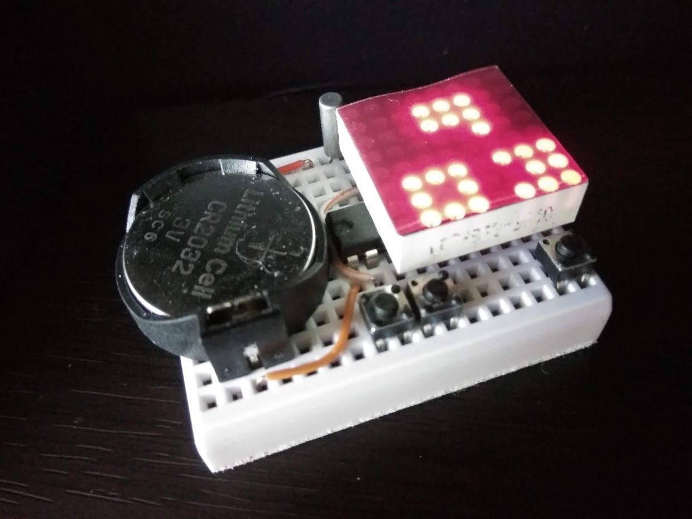<br><br>


### Description

This is a multi-mode clock project based on the MSP430G2432. It can be assembled with minimal parts. With limited 8x8 pixels display resolution, this 12 hour clock shows time in 6 different modes. This project is based on a older attiny 2313 project I did a few years ago.

HHMM mode, (show below), typical hours plus minutes scrolling digits with colon separator. Photo below is not clear as the digits are scrolling.
<br>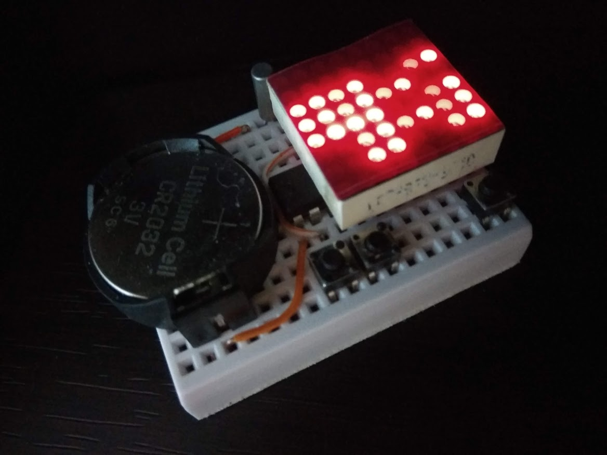<br><br>


Seconds mode (show below), shows only seconds.
<br>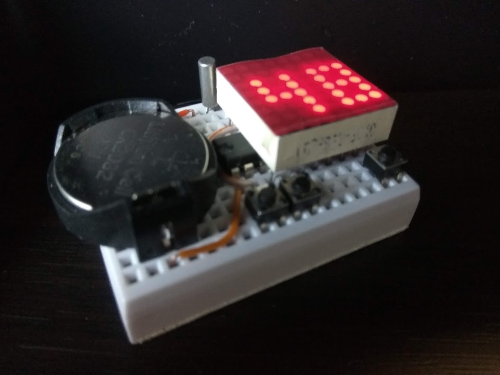<br><br>


Tix mode (shown below), led matrix is divided into quadrant, the upper quadrants shows the hour in bcd (binary coded decimal) values. they are represented by the number of dots to indicate the digits. the lower quadrants show the minute in bcd. i.e. for 4:32 it shows no dot + 4 dots on the upper half and 3 dots + 2 dots on the lower half.
<br>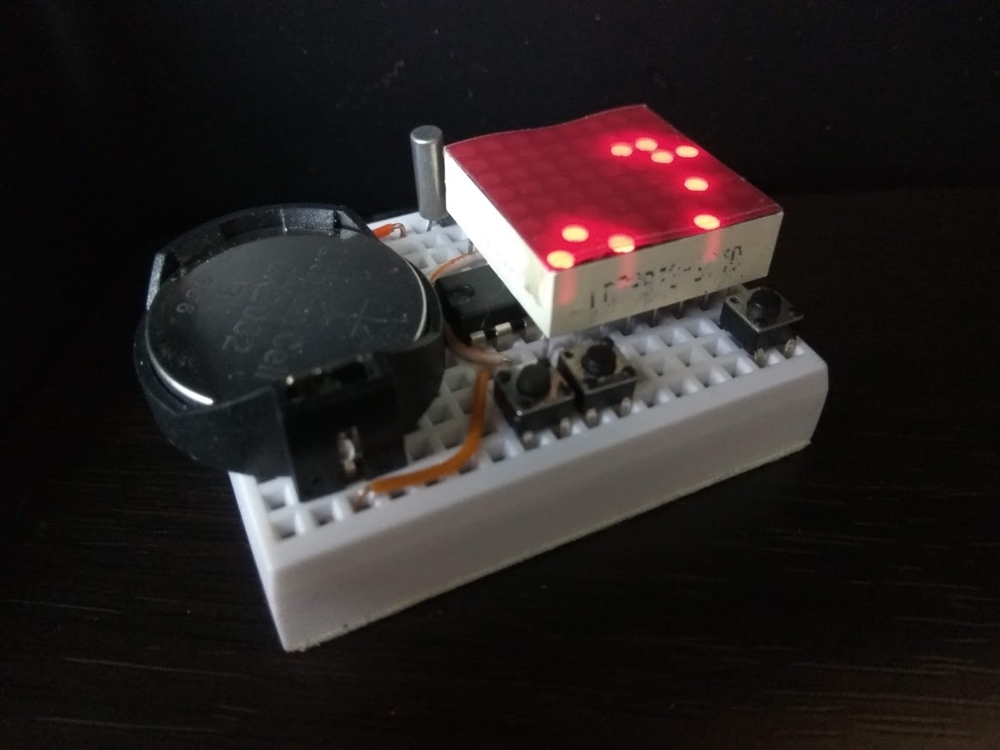<br><br>


Dice mode (shown below), the led matrix is divided into two set of 'dices'. with the upper pair showing hour from 1 - 12, the lower pair of dice shows minutes in 5 minute increments. Upon every seconds the dice will rotate between possible values. For example, the 4th hour can be represented by 0 + 4, 1 + 3, and 2 + 2 combinations of 1 or 2 dices. Below, for 4:32 it shows dice value upper 4 + lower 6 (5 + 1), works out to be 4 hour, 6 x 5 = 30 min, with the odd 2 minute truncated as we only represent values of 5 minute increments.
<br>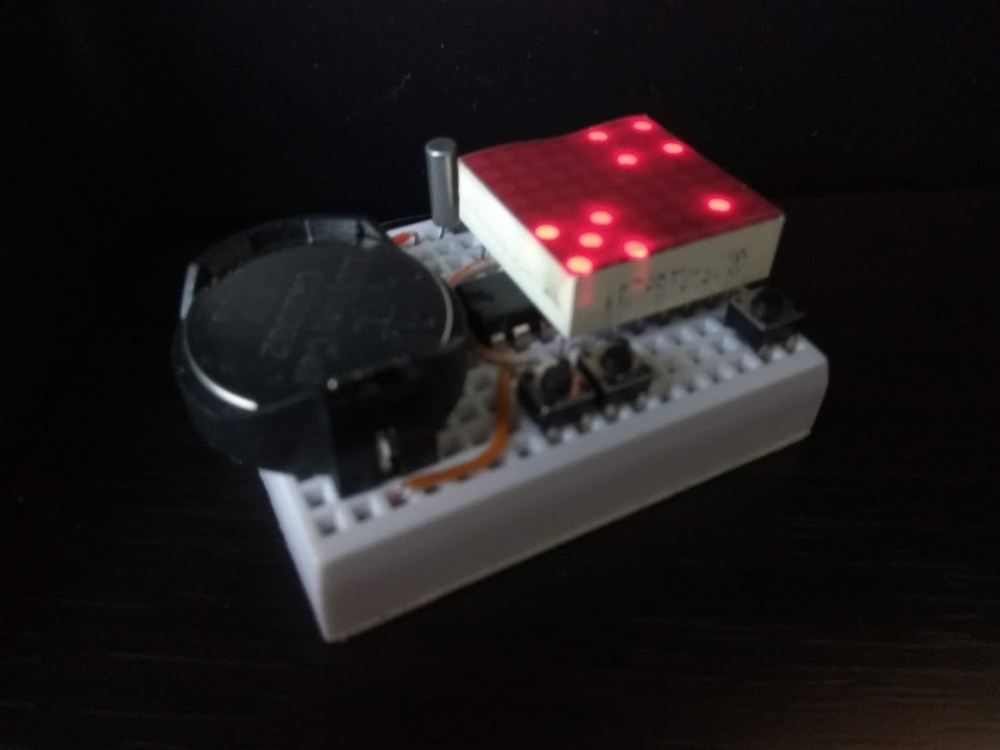<br><br>


Digits mode (show below), a small 3x3 condensed font is used to display both hour and minute without the need of scrolling the digits. The minutes digits shifts left and right on the second and the hour digit (when in the hour of 1 to 9) slides from right to left to indicate every 10 seconds advancement during the minute. 4:33 and about 30+ seconds are show in the example below. 
<br>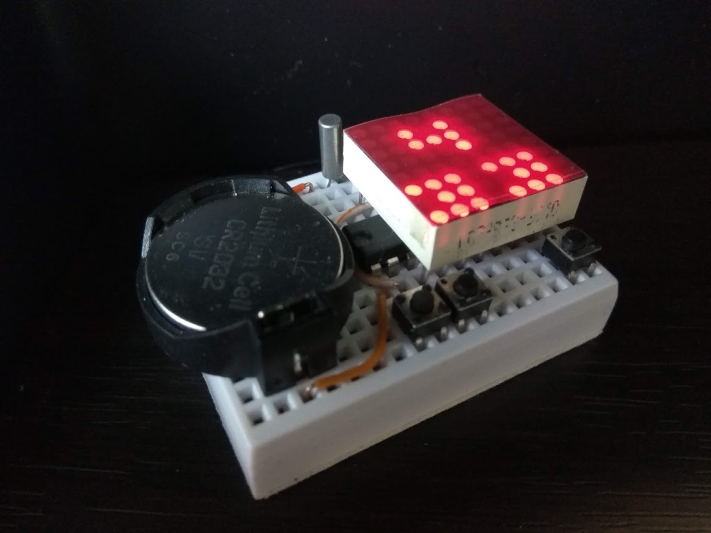<br><br>


Binary (really it's bcd, or binary coded decimal) mode, (shown below) the hour, minute and second digits are show as binary dot on different columns in the led matrix. the columns 0 and 1 (from left) represents the hour digits, column 2 is blanked, columns 3 and 4 represent the minute digits, colum 5 is blanked, columns 6 and 7 represents the second digits. Below repsenting the time of 4:34:16.
<br>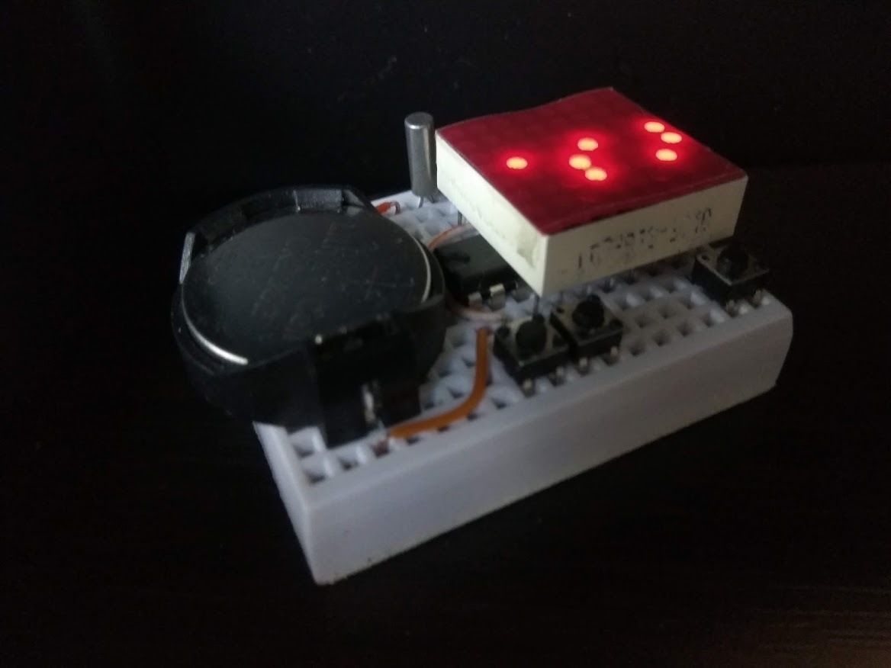<br><br>


The circuit employs row and column multiplexing to drive the leds, one row at a time, this gives a 12.5% duty cycle when "sets" of leds (8 of them in each of the 8 rows) are turn on briefly. current limiting resistors are eliminated to save breadboard estate and as we are not constantly driving individual leds, they are not going to be damaged.

The control (user interface) is also arranged so that we only use one tactile button for input. the firmware capture long button presses (press and hold) for menu rotation and normal button presses for menu selection.

By migrating this project from an AVR mcu to a msp430 mcu I had made it possible to keep time a lot more accurately. During display (i.e. led on) the project runs at 1Mhz DCO. The msp430 mcu has factory calibrated clock values. When not displaying, this project enters a LPM3 (low-power mode 3) to conserve power. At LPM3 the DCO clock cannot be used and the project switches to use a 32Khz crystal based AClk to keep time.

### Features

- Minimal component count, 5 parts.
- Minimal wiring, only 4 wires required.
- Battery operated from 3V to 3.6V.
- Use of watchdog timer to keep time, power-down sleep mode (LPM3) takes uA power.
- 32Khz crystal to keep accurate time when sleep.
- Runs 1Mhz DCO calibrated clock when active (displaying time).
- This is a 12H clock, not 24H and has no AM/PM indicator.
- Easter egg application of Tetris game.


### Parts list

- MSP430G2432 (or other G series dip 20pin devices w/ 4k+ flash)
- 8x8 LED matrix display (red only, this is a 3V project)
- tactile button, you need 3 if you want the Tetris game enabled
- 32Khz clock crystal
- CR2032 or other 3V battery source 

<br>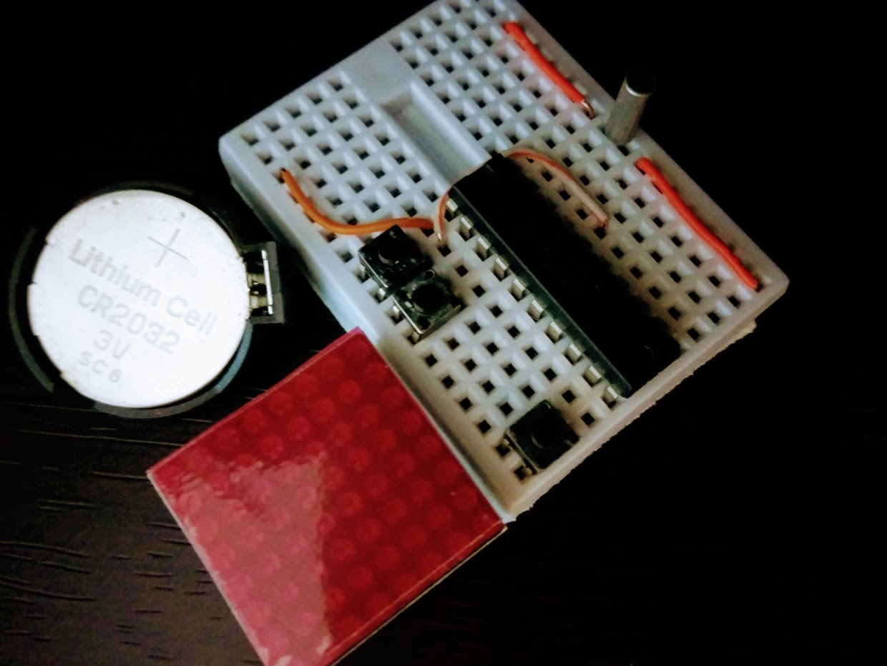<br><br>


### Application Notes

- Short key press in display mode cycles through HHMM, seconds, tix, dice, digits, binary and sleep modes.
- Long press enters setup mode, subsequent long press rotates thru menu.
- Menu items cycles thru 'Set Clock', 'Dimmer', 'Auto-off'.
- In 'Set Clock' setup mode, short presses increment digit values (hours, minutes) and long press confirms.
- In 'Dimmer' setup mode, short presses cycles through available brightness levels, long press confirms setting.
- In 'Auto-off' setup mode, short presses toggle the auto-off on and off. With auto-off turned on, the clock displays time for 12 seconds and turn itself into LPM3 sleep mode to converse power. With auto-off turned off, display is on continuously.
- When in sleep mode, MCU goes in power down mode, consuming less than 30uA of power, 32Khz crystal w/ watchdog timer is used to keep time. A pin interrupt is enabled to allow for wake up via tactile button. In this mode the main clock is disabled to conserve power.
- Led segment multiplexing includes time delays to compensate for brightness differences for individual rows.


### Breadboard Layout

the 8x8 led matrix has dot size of 1.9mm and is of common cathode, if you have common anode type, you can change a few lines in the code for adoption. see the following diagram and see if you have the right pin-outs. it appears they are quite common and if you purchase via ebay most suppliers have the same pin-out even if the model number is different.
<br>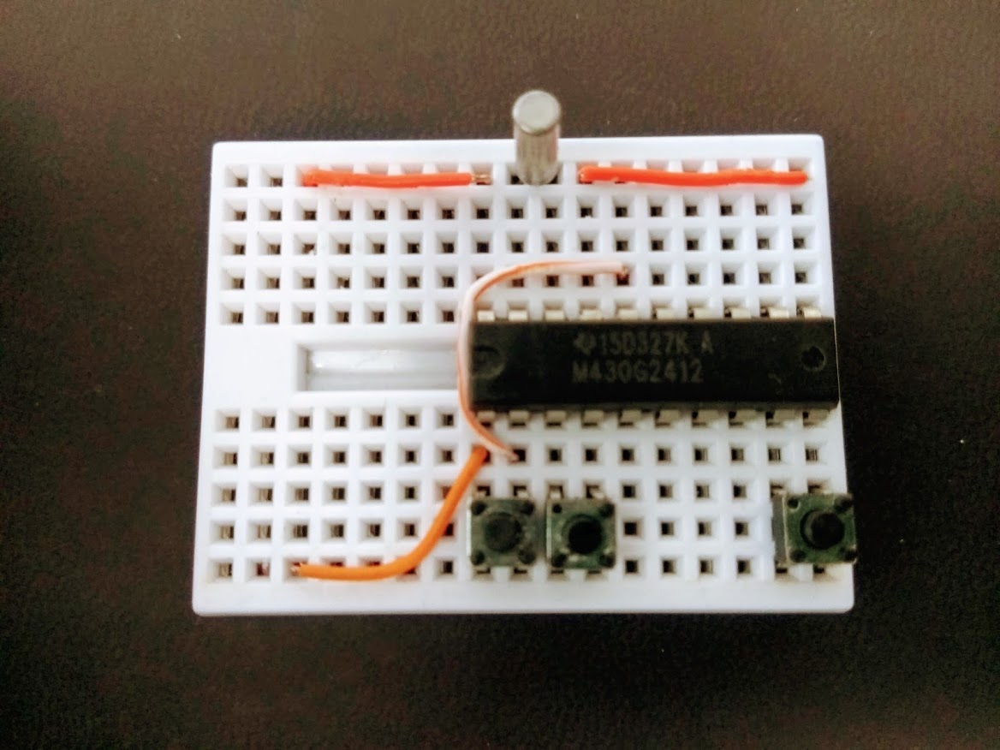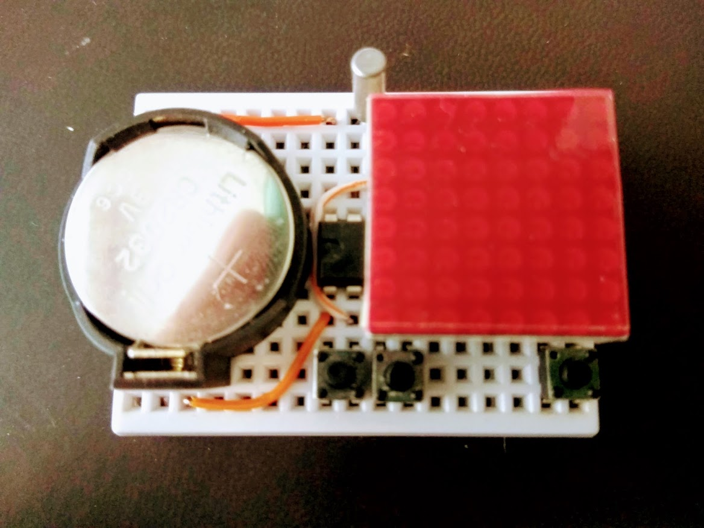<br><br>


```

   +=====================================================+
   |  .  . (-)------------(-) o||o (1)---------------(1) | 32khz clock crystal
   |  .  .  .  .  .  .  .  .  .  .  .  .  .  .  .  .  .  | 
   |  .  . (-) .  .  .  .  .  .  +--+--+--+--+--+--+--+  | CR2032 button cell
   |  .  .  .  .  .  .  .  .  . C7 C6 R1 C0 R3 C5 C3 R0  | 
   |  .  .  .  .  .  .  .+------------(2)             |  | 
   |  .  .  .  .  .  .  .| +--+--+--+--+--+--+--+--+--+  |
   |                     ||G b6 b7 CK IO a7 a6 b5 b4 b3| |
   |                     ||                            | | msp430 mcu
   |                     ||+ a0 a1 a2 a3 a4 a5 b0 b1 b2| |
   |  .  .  .  .  .  .  .|.+--+--+--+--+--+--+--+--+--+  |
   |  .  .  .  .  .  .  .+---(2) +--+--+--+--+--+--+--+  |
   |  .  .  .  .  .  .  .  .  . R4 R6 C1 C2 R7 C4 R5 R2  | 8x8 red led matrix
   |  .  .  .  .  .  .  .  .__.  .__.  .  .  .  .  .__.  |
   |  .  . (+) .  .  .  .  o  o  o  o  .  .  .  .  o  o  | tactile buttons (main, left, right)
   |  .  . (+)------------(+) .  .  .  .  .  .  .  .  .  | 
   +=====================================================+

   . all (1)s, (2)s, (-) and (+) points are electrically connected
   . left and right buttons are optional and only used for tetris game

```


### Schematic


```

                            MSP430G2xxx
                         -----------------
          --------------|RESET            |
          | ------------|TEST             |
          | |           |                 |
          | |   COL4 <--|P2.0         P1.0|--> ROW1 (of LED Matrix)
 /|\      | |   ROW5 <--|P2.1         P1.1|--> ROW4
  |  _|_  | --- ROW2 <--|P2.2         P1.2|--> ROW6
  --o   o--COL7+ROW0 <--|P2.3         P1.3|--> COL1
    Button      COL3 <--|P2.4         P1.4|--> COL2
                COL5 <--|P2.5         P1.5|--> ROW7
      32Khz /-- N.C. <--|P2.6(XIN)    P1.6|--> ROW3
    Crystal \-- COL7 <--|P2.7(XOUT)   P1.7|--> COL0
                        |                 |

    Row 0 and Column 6 uses shared pin to avoid clock crystal conflicts, and led dot at R0+C6 will not light up
    Optional buttons for Tetris game

	|        |
	|        |     _|_
	|    P1.1|----o   o--+	(left game button)
	|    P1.2|-----------+
	|        |
	|        |     _|_
	|    P2.1|----o   o--+  (right game button)
	|    P2.2|-----------+

```


### Assembling

- Follow breadboard layout and place two jumper wires on mini breadboard
- Place MSP430G2432 mcu
- Place 32Khz crystal
- Place Tactile Button
- Place power source (I am using CR2032 button cell)
- Finally place 8x8 led matrix on top of MSP430G2432


### Easter Egg Tetris Game
<br>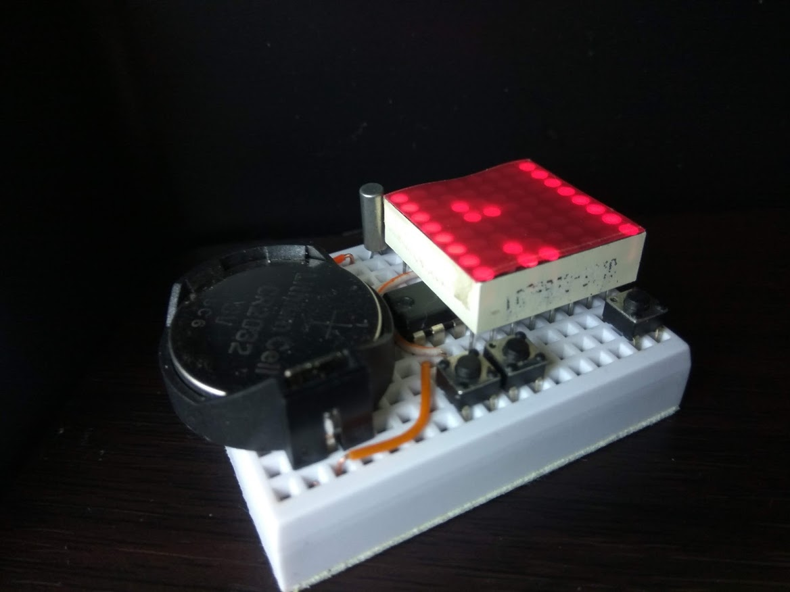<br><br>


With extra flash space on the MCU, I am able to squeeze in a Tetris like game. This easter egg application is eanbled by placing the additional / optional tactile buttons in the right breadboard positions.

Pressing either game (left or right) buttons when the clock is showing will start the game. Game control is via the left and right buttons to move the game piece horizontally, and the clock button, in the game mode, will acts as the game piece rotation button. There is no speed drop in this implementation. When game ends (game pieces stacked up to the ceiling), the score (number of rows eliminated) will be shown briefly as 2 flashing digits.
<iframe width="560" height="315" src="https://www.youtube.com/embed/lck_ptUh88Y" frameborder="0" allow="autoplay; encrypted-media" allowfullscreen></iframe>


### Source code

Source code usually resides in my github repositories.

For this particular project, the single C source file nfft.c is bundled in my [breadboard collections repository](https://github.com/simpleavr/breadboard_collections). You just need nfft.c


