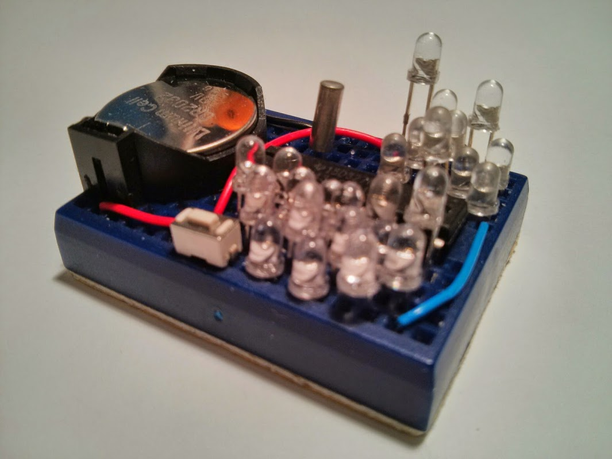
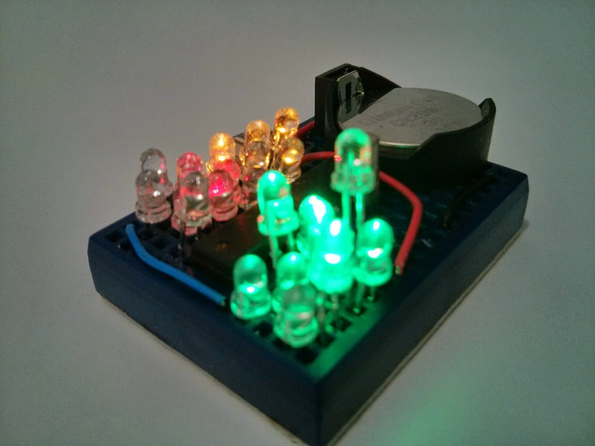

## Tix Clock Gems
`[October 2015]` Originally created.
Tix Clock Implemented In a Gem Mine Diorama.

<iframe width="560" height="315" src="https://www.youtube.com/embed/ujTU1ziXk1o" frameborder="0" allow="autoplay; encrypted-media" allowfullscreen></iframe>

### Description

This TIX clock implementation is a great first time project for beginners. Apart from visually pleasing, the clock is of practical use and keeps accurate time via it's 32Khz clock crystal. The construction is easy as there are only 4 breadboard wires involved.

At the same time it allows certain creativity in that 1) LEDs within the same group can be rellocated for different patterns, and 2) the length of individual LEDs can vary as to different a personalized LED gem "landscape".
The TCG (Tix Clock Gems) demonstrates LED charliplexing in groups and usages of timers.


Tix Clock Tells Time is 8:42
### Features
- Minimal jumper wires, 4 on a mini breadboard
- Personalization via LED placements and leg lengths
- Battery operated from 3V
- Use of 32Khz clock crystal to keep time, power-down sleep mode (LPM3) takes less than 1uA power



in sleep mode
### Parts list

- 170 tie point mini breadboard
- MSP430G2412 (or other G/F series dip 20 pin devices w/ 4k flash)
- Lots of LEDs (1 blue, 9 green, 6 yellow, 9 red)
- Tactile button
- 32Khz clock crystal
- CR2032 button cell holder (battery not included)

### Application Notes

- Single button press shows time for a few seconds, TCG returns to sleep after that
- Long press setup time, starting with the hours, related LEDs starts to blink
- Short press advance the hour value. Another Long press confirms the entry
- The tenths of the minutes and the minutes are subsequently entered like the hour
- Once the hours and minutes (tenths and singles) have been entered, TCG returns to show mode



### Breadboard Layout

```

   +=====================================================+
   |  .  o-----(W3)-----o  .  .  .  .  .  .1>.  .8>.  .  |
   |  . (-) .  .  .  .  .  .  .  .  .  .+>.  .4>.  .3>.  |
   |                \.  .  oXTo  .  .  .  .<5.  .<6.  .  | XT 32Khz Clock Crystal
   |                 :+-(W1)--------o  .<7.  .<2.  .<9.  | W1 +ve battery to IO (reset)
   | Battery Holder  :| ---+--+--+--+--+--+--+--+--+  o  | W2 b2 to led extension column
   |                 :||- b6 b7 CK IO a7 a6 b5 b4 b3| |  | W3, W4 battery power to MCU
   |                 :||+ a0 a1 a2 a3 a4 a5 b0 b1 b2|(W2)|
   |                 :| ---+--+--+--+--+--+--+--+--+  |  |
   |                 :| .  .  .1>.  .9>.  .1>.  .2>.  |  | > side of led is anode (longer leg)
   |                /.| .  .2>.  .3>.  .4>.  .3>.  o--+  |
   |  . (+) .  .  .  .| .  .  .<6.  .<5.  .<6.  .<5.  .  |
   |  .  o-----(W4)---+-o-[B]-o  .<4.  .<7.  .<8.  .  .  |
   +=====================================================+

```


### Schematic

```
                            MSP430G2xxx
                         -----------------
                        |                 |                   /|\
                     <--|TEST        RESET|--------------------+
                        |                 |                    |
               ~~~~~~~~ |P2.0         P1.0|--> ~~~~~~~    _|_  |
              {         |P2.1         P1.1|-->        }--o   o-+ button
              { Magic   |P2.2         P1.2|-->        }
              {  LOL    |P2.3         P1.3|-->  Many  }
              {         |P2.4         P1.4|-->  LEDs  }
               ~~~~~~~~ |P2.5         P1.5|-->        }
      32Khz /-----------|P2.6(XIN)    P1.6|-->        }
    Crystal \-----------|P2.7(XOUT)   P1.7|--> ~~~~~~~
                        |                 |

```


### Assembling
Follow breadboard layout and place jumper wire on mini breadboard
Place MSP430G2412 on breadboard
Place Tactile Button
Cut your LEDs into different lengths, *be sure to maintain one leg longer
Place LEDs in groups of (1..9), opposing pairs on the same pin can be swapped for effect. Ex at b0-b1 #3 and #8  can be swapped. The "+>" is the blue LED indicating 10+ hours
Place Battery Holder
### Source code
Source code usually resides in my github repositories.
For this particular project, the single C source file tix.c is bundled in my <a href="https://github.com/simpleavr/breadboard_collections">breadboard collections repository. You just need tix.c


